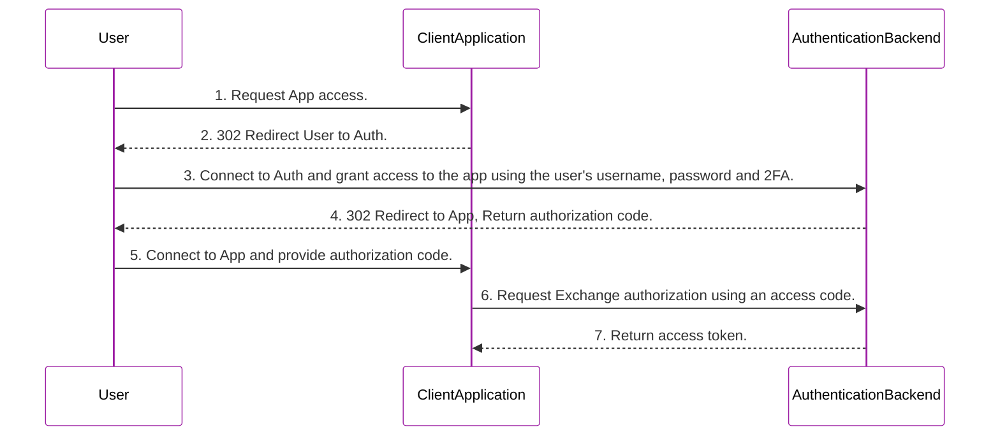

  

    
  

  <h3>fastapi oauth2 service</h3>

  

    
  

  
A FastAPI-based OAuth2 service that enables secure user authentication and authorization, providing token management and API access control for seamless integration with applications.

### Features
- [x] CRUD Users
- [x] Reset User Password via email or sms
- [x] Admin UI panel

### Oauth2 code Flow

