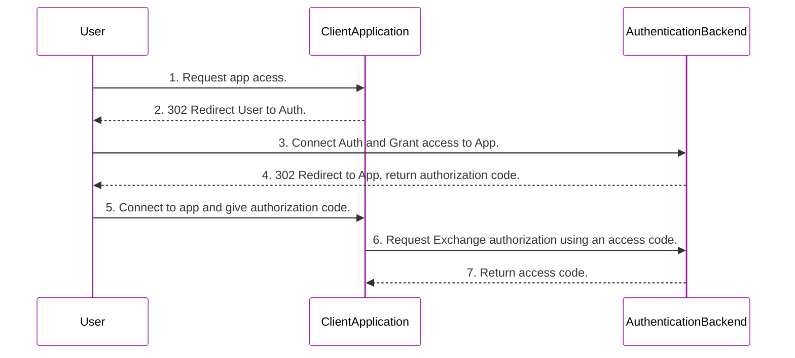

  

    
  

  <h3>fastapi oauth2 service</h3>

  

    
  

### Authentification Flow

```mermaid
%%{init: {'theme': 'base', 'themeVariables': { 'primaryColor': 'transparent', 'secondaryColor': 'transparent', 'tertiaryColor': 'transparent', 'actorTextColor': '#000000', 'lineColor': '#00FF00', 'primaryBorderColor': '#9c1ca3'}}}%%

sequenceDiagram
    participant User
    participant Client as ClientApplication
    participant Auth as AuthenticationBackend

    User->>Client: 1. Request app acess.
    Client-->>User: 2. 302 Redirect User to Auth.
    User->>Auth: 3. Connect Auth and Grant access to App.
    Auth-->>User: 4. 302 Redirect to App, return authorization code.
    User->>Client: 5. Connect to app and give authorization code.
    Client->>Auth: 6. Request Exchange authorization using an access code.
    Auth-->>Client: 7. Return access code.
```

