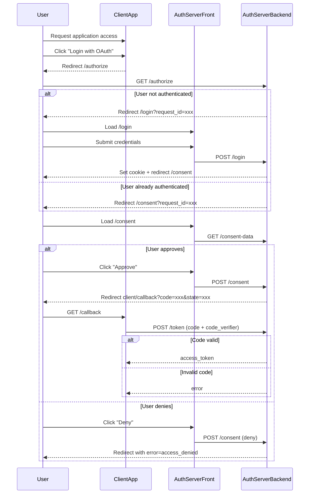

<div align="center">
  <p>
    
  </p>
  <a href="https://git.io/typing-svg">
    
  </a>
</div>

<div align="center">
  <p>
    <a href="https://github.com/abdoulfataoh/fastapi-oauth2-service/actions/workflows/test.yaml"></a>
  </p>
  <p>
    A FastAPI-based authentication server implementing OAuth2 Authorization Code Flow with PKCE, user authentication, OTP verification, and consent-based authorization.
</p>
</div>

### Features

- [x] OAuth2 Authorization Code Flow with PKCE
- [x] Secure access token (JWT)
- [x] Public user registration with OTP verification (email/SMS)
- [x] User authentication and consent-based authorization
- [x] OAuth client (application) registration and management
- [x] Scope-based access control
- [x] Protection against user enumeration and brute-force attacks
- [x] Admin panel for managing users and OAuth clients

### Oauth2 code Flow with PKCE Diagram


```mermaid

sequenceDiagram
    participant User
    participant ClientApp
    participant AuthServerFront
    participant AuthServerBackend

    %% Step 0: Entry point
    User->>ClientApp: Request application access

    %% Step 1: Start OAuth
    User->>ClientApp: Click "Login with OAuth"
    ClientApp-->>User: Redirect /authorize
    User->>AuthServerBackend: GET /authorize

    %% Step 2: Auth check
    alt User not authenticated
        AuthServerBackend-->>User: Redirect /login?request_id=xxx
        User->>AuthServerFront: Load /login
        User->>AuthServerFront: Submit credentials
        AuthServerFront->>AuthServerBackend: POST /login
        AuthServerBackend-->>User: Set cookie + redirect /consent
    else User already authenticated
        AuthServerBackend-->>User: Redirect /consent?request_id=xxx
    end

    %% Step 3: Consent
    User->>AuthServerFront: Load /consent
    AuthServerFront->>AuthServerBackend: GET /consent-data

    alt User approves
        User->>AuthServerFront: Click "Approve"
        AuthServerFront->>AuthServerBackend: POST /consent

        AuthServerBackend-->>User: Redirect client/callback?code=xxx&state=xxx
        User->>ClientApp: GET /callback

        %% Step 4: Token exchange
        ClientApp->>AuthServerBackend: POST /token (code + code_verifier)

        alt Code valid
            AuthServerBackend-->>ClientApp: access_token
        else Invalid code
            AuthServerBackend-->>ClientApp: error
        end

    else User denies
        User->>AuthServerFront: Click "Deny"
        AuthServerFront->>AuthServerBackend: POST /consent (deny)
        AuthServerBackend-->>User: Redirect with error=access_denied
    end

```


### Usage

```bash
  make help
```

```bash

Available commands:
--------------------------------
make help            - Display this help message
make dev             - Run development server
make prod            - Run production server
make test            - Run tests
make lint            - Run linter
make docker-build    - Build docker image
make test-all        - Run lint + tests

Database commands:
--------------------------------
make db-migrate m='msg' - Create migration
make db-upgrade        - Apply migrations
make db-downgrade      - Rollback last migration
make db-current        - Show current revision
make db-history        - Show migration history
make db-reset          - Reset DB (dev only)

Cleanup:
--------------------------------
make reset            - Reset DB + clean cache
```
