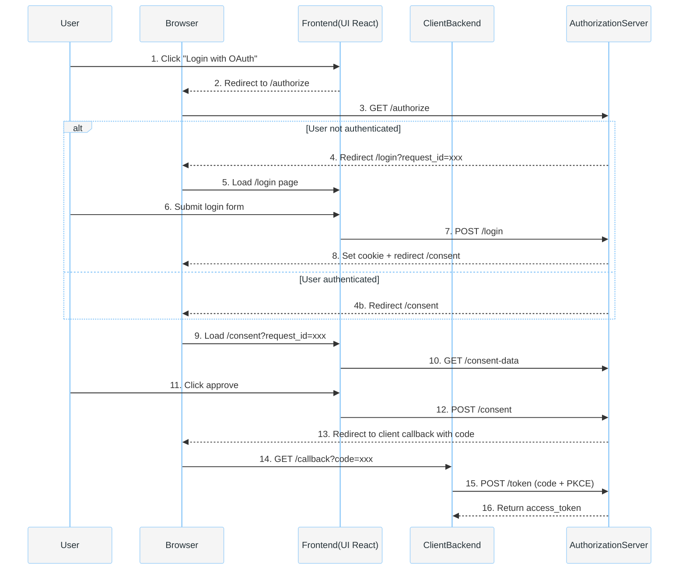

  

    
  

  

  

    
  

  

    A secure OAuth2 authorization server built with FastAPI, implementing the Authorization Code Flow with PKCE for internal and SaaS applications. 
    It provides user authentication, OTP verification, and a consent-based authorization system with strong security and clean architecture.

### Features

- [x] OAuth2 Authorization Code Flow with PKCE
- [x] Secure access and refresh token management (JWT)
- [x] Public user registration with OTP verification (email/SMS)
- [x] User authentication and consent-based authorization
- [x] OAuth client (application) registration and management
- [x] Scope-based access control
- [x] Token expiration and revocation
- [x] Protection against user enumeration and brute-force attacks
- [x] Admin panel for managing users and OAuth clients
- [x] Built with FastAPI and clean, modular architecture

### Oauth2 code Flow

```mermaid

%%{init: {
  'theme': 'base',
  'themeVariables': {
    'primaryColor': '#f5f5f5',
    'secondaryColor': '#e3f2fd',
    'tertiaryColor': '#e8f5e9',
    'primaryBorderColor': '#90caf9',
    'lineColor': '#546e7a',
    'actorTextColor': '#263238',
    'fontSize': '18px'
  }
}}%%

sequenceDiagram
    participant User
    participant Browser
    participant Frontend as Frontend(UI React)
    participant Client as ClientBackend
    participant Auth as AuthorizationServer

    User->>Frontend: 1. Click "Login with OAuth"

    Frontend-->>Browser: 2. Redirect to /authorize
    Browser->>Auth: 3. GET /authorize

    alt User not authenticated
        Auth-->>Browser: 4. Redirect /login?request_id=xxx
        Browser->>Frontend: 5. Load /login page
        User->>Frontend: 6. Submit login form
        Frontend->>Auth: 7. POST /login
        Auth-->>Browser: 8. Set cookie + redirect /consent
    else User authenticated
        Auth-->>Browser: 4b. Redirect /consent
    end

    Browser->>Frontend: 9. Load /consent?request_id=xxx
    Frontend->>Auth: 10. GET /consent-data

    User->>Frontend: 11. Click approve
    Frontend->>Auth: 12. POST /consent

    Auth-->>Browser: 13. Redirect to client callback with code
    Browser->>Client: 14. GET /callback?code=xxx

    Client->>Auth: 15. POST /token (code + PKCE)
    Auth-->>Client: 16. Return access_token


```

